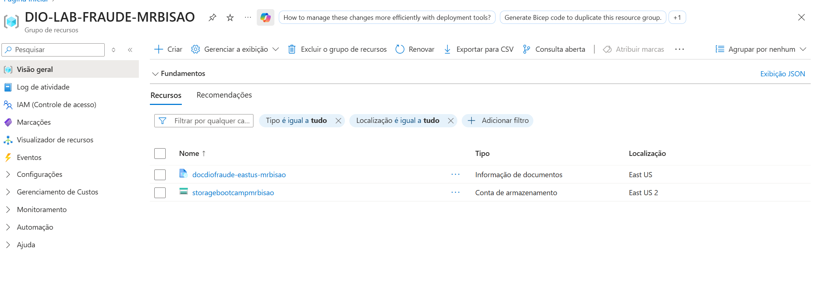
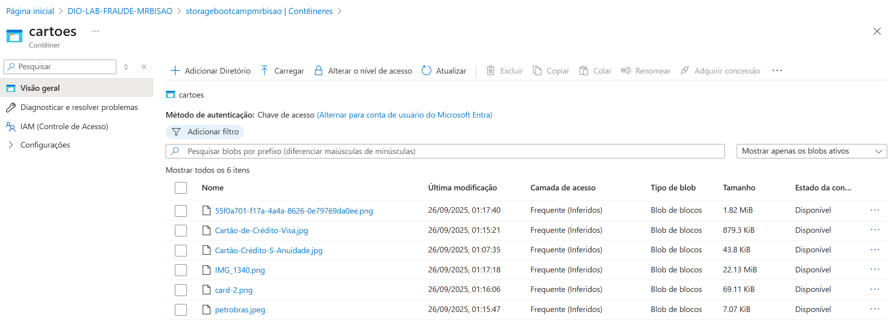
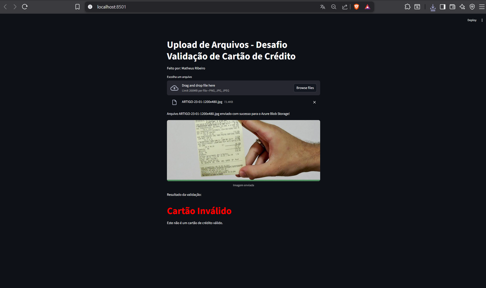

# Nesse projeto utilizamos recursos do Azure para validação de Cartões de Credito

## Foram utilizados os recursos:
Informação de Documentos
Conta de Armazenamento (Container de Armazenamento para armazenar as imagens dos cartões testados)




## Os testes foram feitos via API com Python

Os códigos utilizados estão na pasta [Códigos](Códigos/)


É necessário fazer instalação de algumas bibliotecas do python para funcionamento, elas estão listadas no arquivo [Requirements](Códigos/requirements.txt)

## para instalar

```
pip install -r requirements.txt (com python já instalado
``` 
O projeto deve ficar assim no seu editor (Visual Code)

```
📦 ANTI-FRAUDE
├─ .env                       # ENDPOINT, SUBSCRIPTION_KEY, AZURE_STORAGE_CONNECTION_STRING, CONTAINER_NAME
└─ src/
   ├─ app.py                  # ponto de entrada (Streamlit)
   ├─ requirements.txt        # dependências (streamlit, azure-storage-blob, python-dotenv, etc.)
   ├─ services/
   │  ├─ blob_service.py      # upload_blob(): envia arquivos ao Azure Blob Storage
   │  └─ credit_card_service.py   # (ex.: lógica de validação/anti-fraude)
   └─ utils/
      └─ Config.py            # class Config: lê variáveis do .env
```
# Testes 





